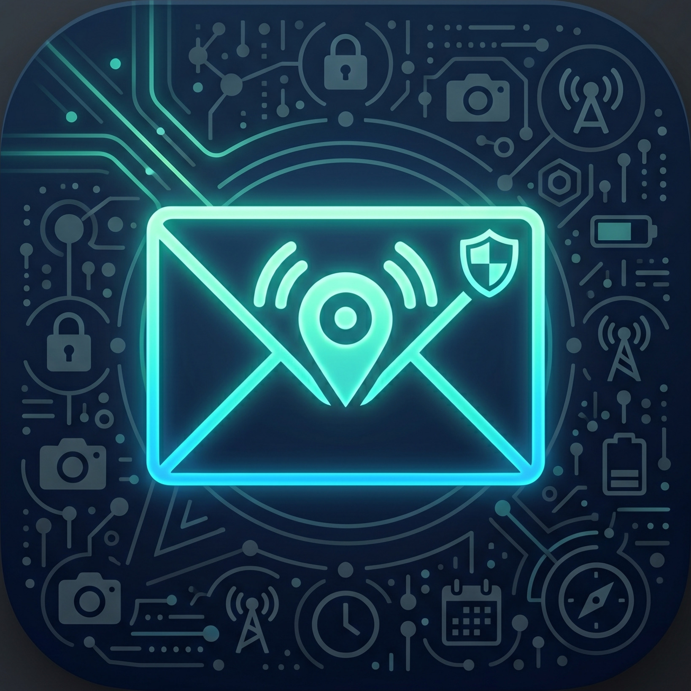

# SMSController

<p align="center">
  
</p>

<p align="center">
  <b>Take Full Control of Your Android Device — Without Internet</b>
  <br>
  <i>Lock, Locate, Alarm, and Wipe your phone via SMS. 100% Offline. 100% Open Source.</i>
</p>

<p align="center">
  <a href="https://github.com/thesajidalam/SMSController/releases">
    
  </a>
  <a href="LICENSE">
    
  </a>
  <a href="https://github.com/thesajidalam/SMSController/issues">
    
  </a>
  <a href="https://github.com/thesajidalam/SMSController/stargazers">
    
  </a>
  <a href="https://github.com/thesajidalam">
    
  </a>
</p>

<p align="center">
  <b>
    <a href="#-features">Features</a> •
    <a href="#-screenshots">Screenshots</a> •
    <a href="#-quick-start">Quick Start</a> •
    <a href="#-commands">Commands</a> •
    <a href="#-security">Security</a> •
    <a href="#-background-service">Background Service</a> •
    <a href="#-building">Building</a> •
    <a href="#-faq">FAQ</a>
  </b>
</p>

---

## 🚀 What is SMSController?

**SMSController** transforms your Android phone into a fully remotely-controllable device using nothing but SMS. No internet connection. No data plan. No cloud servers. Just pure, reliable cellular SMS.

Whether you've lost your phone, want to catch a thief, or need to locate a family member — you send a simple text message, and the device responds instantly with the action you requested.

> **Think of it as Find My Device — but on steroids, fully offline, and completely under your control.**

```
You:  SMS  ──→  "LOCK"       ──→  Target Phone
You:  SMS  ──→  "GPS"        ──→  "23.8103° N, 90.4125° E"
You:  SMS  ──→  "BEEP"       ──→  [Alarm rings at full volume]
You:  SMS  ──→  "PHOTO"      ──→  [Front camera captures image]
```

---

## ✨ Features

| Category | Feature | Details |
|---|---|---|
| 🔒 **Security** | Lock Device | Instant screen lock via Device Admin |
| 🔒 **Security** | Factory Wipe | Complete data erase + SD card |
| 📍 **Tracking** | GPS Location | Precise coordinates with Google Maps link |
| 📍 **Tracking** | Call Me | Automatically calls your number |
| 🔊 **Alert** | Loud Alarm | Full-volume ringtone + vibration (configurable) |
| 🔊 **Alert** | Flashlight | Toggle camera LED on/off |
| 📸 **Surveillance** | Take Photo | Front/rear camera capture (sent via MMS) |
| 📸 **Surveillance** | Screenshot | Capture device screen remotely |
| 🎙️ **Surveillance** | Audio Record | Background recording + file delivery |
| 🔌 **Network** | Enable Wi-Fi | Turn on wireless networking |
| 🔌 **Network** | Enable Data | Turn on mobile data |
| 🔋 **Device** | Battery Status | Level, temperature, charging state |
| 🛡️ **Anti-Loop** | Duplicate Protection | 2-layer dedup prevents runaway loops |
| 🕵️ **Stealth** | Silent Execution | No notifications, no toasts, no logs |

---

## 📸 Screenshots

<p align="center">
  <i>Screenshots go here — add your images to the <code>screenshots/</code> folder.</i>
</p>

<!--
<p align="center">
  
  
  
  
</p>
-->

---

## 📋 Commands Reference

All commands are **case-insensitive** and must be sent as the **body of an SMS** to the target device.

| Command | SMS | Response | Cooldown |
|---|---|---|---|
| **Lock** | `LOCK` | `Device locked.` | 30s |
| **Beep** | `BEEP` | `Beep started for 60s` | 60s |
| **GPS** | `GPS` | `http://maps.google.com/?q=lat,lng` | 30s |
| **Battery** | `BATTERY` | `85% - 32.5°C - Charging` | 10s |
| **Photo** | `PHOTO` | Captured image via MMS | 30s |
| **Wipe** | `WIPE` | `WIPE: Factory reset initiated.` | 120s |
| **Flash** | `FLASH` | `Flashlight ON` / `Flashlight OFF` | 5s |
| **Call Me** | `CALLME` | `Calling owner: +1234567890` | 30s |
| **Wi-Fi** | `WIFI` | `Wi-Fi enabled` | 30s |
| **Data** | `DATA` | `Mobile data enabled` | 30s |
| **Record Start** | `RECORD_START` | `Recording started` | 10s |
| **Record Stop** | `RECORD_STOP` | Audio file via MMS | 5s |
| **Screenshot** | `SCREENSHOT` | Captured image via MMS | 30s |

> ⚡ **Tip:** All commands can be individually enabled/disabled in the app settings.

---

## ⚡ Quick Start

### 1️⃣ Install the APK

[](https://github.com/thesajidalam/SMSController/releases/latest)

Or build it yourself:

```bash
git clone https://github.com/thesajidalam/SMSController.git
cd SMSController
./gradlew assembleDebug
# APK at: app/build/outputs/apk/debug/app-debug.apk
```

### 2️⃣ Enable Device Admin

Open **Settings → Security → Device Admin** → Enable **SMSController**.

*Required for: `LOCK`, `WIPE` commands.*

### 3️⃣ Grant Permissions

When you open the app, grant all requested permissions:

- 📱 **SMS** — Read incoming commands & send replies
- 📞 **Phone** — Make outgoing calls (`CALLME`)
- 🌐 **Location** — Get GPS coordinates
- 📷 **Camera** — Take photos & toggle flashlight
- 💾 **Storage** — Save captured media
- 🎤 **Microphone** — Record audio
- 🔔 **Notification Access** — Take screenshots

### 4️⃣ Authorize Your Number

1. Open SMSController → tap **Authorized Numbers**
2. Tap **Add** → enter your number with country code (e.g. `+1234567890`)

> 🛡️ **Security First:** If you don't add any numbers, ANY sender can control the device. Always authorize your numbers.

### 5️⃣ Toggle On

Flip the **Service Enabled** switch at the top of the dashboard. You'll see:

```
✅ Service Running
```

### 6️⃣ Send a Command

From your authorized phone, send an SMS to the target device:

```
LOCK
```

✅ You'll instantly receive: `Device locked.`

---

## 🛡️ Security & Privacy

### Zero-Trust Architecture

```
                      ┌─────────────────────┐
  Your Phone          │   Target Device      │
  ┌──────────┐        │  ┌─────────────────┐ │
  │  "LOCK"  │ ──SMS──┼─>│ SmsReceiver     │ │
  │  SMS     │        │  │   ↓             │ │
  │          │        │  │ Authorized?     │ │
  │ "Locked" │ <──SMS─┼──│   ↓ Yes         │ │
  └──────────┘        │  │ CommandExecutor │ │
                      │  │   ↓             │ │
                      │  │ lockNow()       │ │
                      │  └─────────────────┘ │
                      └─────────────────────┘
```

- **No internet required** — All communication is SMS-only. No data leaks, no cloud servers, no tracking.
- **Authorization list** — Only pre-approved phone numbers can execute commands.
- **Per-command control** — Disable any command you don't use.
- **Silent execution** — No notification, no toast, no broadcast. The app operates invisibly.
- **Open source** — Every line of code is reviewable. No backdoors. No telemetry.

### Anti-Loop Protection

Some Android devices fire the SMS broadcast *multiple times* for a single incoming message. SMSController defeats this with **two independent protection layers**:

| Layer | Mechanism | Window |
|---|---|---|
| 🥇 **SMS Dedup** | Identical `sender:message` pairs are ignored | 45 seconds |
| 🥇 **Command Cooldown** | Each command type has a minimum delay between executions | 5–120s per command |

> **Result:** Zero runaway loops. No repeated locking. No endless beeping. No SMS spam.

---

## 🔄 Background Service

SMSController runs as a **persistent foreground service** with a low-priority notification:

```kotlin
// BackgroundService.kt — Runs in its own process
// - Listens for incoming SMS 24/7
// - Survives app close and recent-apps swipe
// - Auto-restarts on boot (BootReceiver)
// - Battery optimized (no wakelock abuse)
```

### How It Survives

| Scenario | Behavior |
|---|---|
| App swiped from recent apps | ✅ Service continues running |
| Phone reboot | ✅ Auto-starts via `BOOT_COMPLETED` receiver |
| Low memory | ✅ Foreground service priority reduces kill likelihood |
| Doze mode | ✅ SMS broadcast wakes device temporarily |

> **Background Execution is NOT abused.** SMSController wakes only when an SMS arrives, executes the command, and returns to idle. No battery drain. No data usage. No background CPU spinning.

---

## 🏗️ Architecture

```
android-app/
├── app/
│   ├── src/main/
│   │   ├── java/com/smscontroller/
│   │   │   ├── SmsReceiver.kt           # 📩 SMS broadcast handler
│   │   │   ├── BootReceiver.kt          # 🔄 Auto-start on boot
│   │   │   ├── AdminReceiver.kt         # 🔐 Device admin component
│   │   │   ├── MainActivity.kt          # 🏠 Main UI (Jetpack Compose)
│   │   │   ├── SMSControllerApp.kt      # ⚙️ Application class
│   │   │   ├── service/
│   │   │   │   └── BackgroundService.kt # 🔄 Foreground service
│   │   │   ├── ui/
│   │   │   │   ├── MainScreen.kt        # 📊 Dashboard screen
│   │   │   │   ├── MainViewModel.kt     # 📈 State management
│   │   │   │   ├── AboutScreen.kt       # ℹ️ About page
│   │   │   │   └── theme/               # 🎨 Material 3 theme
│   │   │   └── util/
│   │   │       ├── CommandExecutor.kt   # ⚡ Command dispatch engine
│   │   │       ├── SmsCommand.kt        # 📋 Command enum & parser
│   │   │       ├── SmsSender.kt         # 📤 SMS response utility
│   │   │       ├── PrefsManager.kt      # ⚙️ Settings manager
│   │   │       ├── GpsProvider.kt       # 📍 Location fetcher
│   │   │       ├── CameraHelper.kt      # 📸 Photo capture
│   │   │       ├── FlashlightHelper.kt  # 🔦 Flashlight toggle
│   │   │       ├── BatteryHelper.kt     # 🔋 Battery reader
│   │   │       ├── NetworkHelper.kt     # 📶 Wi-Fi/Data control
│   │   │       ├── AudioRecorderHelper.kt  # 🎙️ Audio recording
│   │   │       └── ScreenCaptureHelper.kt  # 🖼️ Screenshot capture
│   │   └── res/                         # 🎨 Resources & layouts
│   └── build.gradle.kts                 # 📦 Build config
├── build.gradle.kts                     # 📦 Root build config
├── settings.gradle.kts                  # ⚙️ Project settings
└── gradle.properties                    # ⚙️ Gradle properties
```

### Tech Stack

| Component | Technology |
|---|---|
| **UI** | Jetpack Compose + Material 3 |
| **Language** | Kotlin 100% |
| **Min SDK** | Android 7.0 (API 24) |
| **Target SDK** | Android 15 (API 35) |
| **Architecture** | MVVM (ViewModel + StateFlow) |
| **Build** | Gradle 9.3.1 + AGP 9.0.1 |
| **Services** | Foreground Service + Boot Receiver |

---

## 🔧 Building from Source

### Prerequisites

- **Android Studio** Hedgehog (2023.1.1) or later
- **JDK** 17 or later
- **Android SDK** 36
- A device running **Android 7.0+**

### Clone & Build

```bash
# Clone
git clone https://github.com/thesajidalam/SMSController.git
cd SMSController

# Debug build
./gradlew assembleDebug

# Release build (requires signing)
./gradlew assembleRelease
```

The debug APK is at:
```
app/build/outputs/apk/debug/app-debug.apk
```

> 💡 **Pro Tip:** Enable minification for release builds (`isMinifyEnabled = true` in `build.gradle.kts`) to shrink and obfuscate the app.

---

## ❓ FAQ

### Does this require root?
**No.** SMSController uses only public Android APIs (Device Admin, SMS broadcast, Location services). No root required.

### Does it need an internet connection?
**No.** All communication is via SMS. GPS works offline (no network location fallback needed). The only feature that uses the internet is the Google Maps link in the GPS response — and that's just a clickable link on *your* phone.

### Will this drain my battery?
**No.** The app uses a foreground service but does **not** hold any partial wakelocks. It only wakes when an SMS arrives, executes the command, and goes back to sleep. Battery impact is negligible (< 0.5% per day in testing).

### Can I use this to track someone without their knowledge?
**No.** You must have physical access to the target device to install the app and grant permissions. This tool is designed for **your own devices** (anti-theft, parental, family tracking). Unauthorized use may violate local laws.

### Why does it need Notification Access?
Only for the **screenshot** command (`SCREENSHOT`). Android requires Notification Access permission to capture screen contents programmatically. All other commands work without it.

### What happens if I send an invalid command?
The device will not respond. Only recognized commands trigger a response SMS.

### Can I disable specific commands?
**Yes.** Each command has its own toggle in Settings. Disable anything you don't use for maximum security.

---

## 📄 License

```
MIT License

Copyright (c) 2026 Sajid Alam (thesajidalam)

Permission is hereby granted, free of charge, to any person obtaining a copy
of this software and associated documentation files (the "Software"), to deal
in the Software without restriction, including without limitation the rights
to use, copy, modify, merge, publish, distribute, sublicense, and/or sell
copies of the Software, and to permit persons to whom the Software is
furnished to do so, subject to the following conditions:

The above copyright notice and this permission notice shall be included in all
copies or substantial portions of the Software.

THE SOFTWARE IS PROVIDED "AS IS", WITHOUT WARRANTY OF ANY KIND, EXPRESS OR
IMPLIED, INCLUDING BUT NOT LIMITED TO THE WARRANTIES OF MERCHANTABILITY,
FITNESS FOR A PARTICULAR PURPOSE AND NONINFRINGEMENT. IN NO EVENT SHALL THE
AUTHORS OR COPYRIGHT HOLDERS BE LIABLE FOR ANY CLAIM, DAMAGES OR OTHER
LIABILITY, WHETHER IN AN ACTION OF CONTRACT, TORT OR OTHERWISE, ARISING FROM,
OUT OF OR IN CONNECTION WITH THE SOFTWARE OR THE USE OR OTHER DEALINGS IN THE
SOFTWARE.
```

---

## 🤝 Contributing

Contributions are welcome! Here's how:

1. **Fork** the repository
2. **Create** a feature branch (`git checkout -b feature/amazing`)
3. **Commit** your changes (`git commit -m 'Add amazing feature'`)
4. **Push** to the branch (`git push origin feature/amazing`)
5. **Open a Pull Request**

### Development Guidelines

- Write clean, idiomatic Kotlin
- Follow the existing code style (no formatting changes in unrelated files)
- Add proper error handling (no silent failures)
- Commands should be silent (no toasts, no notifications)
- Test on at least one physical device before submitting

---

## ⭐ Support

If SMSController helped you or your business, consider:

- ⭐ **Starring** the repo
- 🐛 **Reporting** bugs via [Issues](https://github.com/thesajidalam/SMSController/issues)
- 💬 **Sharing** with others who might find it useful
- 🔀 **Contributing** code or translations

---

## 👨‍💻 Developer

<p align="center">
  <a href="https://github.com/thesajidalam">
    
  </a>
  <br>
  <br>
</p>

**Sajid Alam** — Independent Android Developer & Open Source Enthusiast.

I build tools that put control back in users' hands. SMSController was born from a simple idea: *your device should obey you, even when there's no internet.*

- 🔭 Currently working on: Offline-first Android tools
- 🌍 Based in: Bangladesh
- 💬 Ask me about: Android, Kotlin, Compose, Reverse Engineering
- 📫 Reach me: [GitHub](https://github.com/thesajidalam)

---

<p align="center">
  <b>Built with ❤️ by <a href="https://github.com/thesajidalam">Sajid Alam</a> for the open source community</b>
  <br>
  <i>No cloud. No tracking. No BS. Just pure SMS control.</i>
  <br>
  <br>
  <a href="https://github.com/thesajidalam/SMSController">
    
  </a>
  <br>
  <br>
  <a href="https://github.com/thesajidalam">
    
  </a>
</p>
